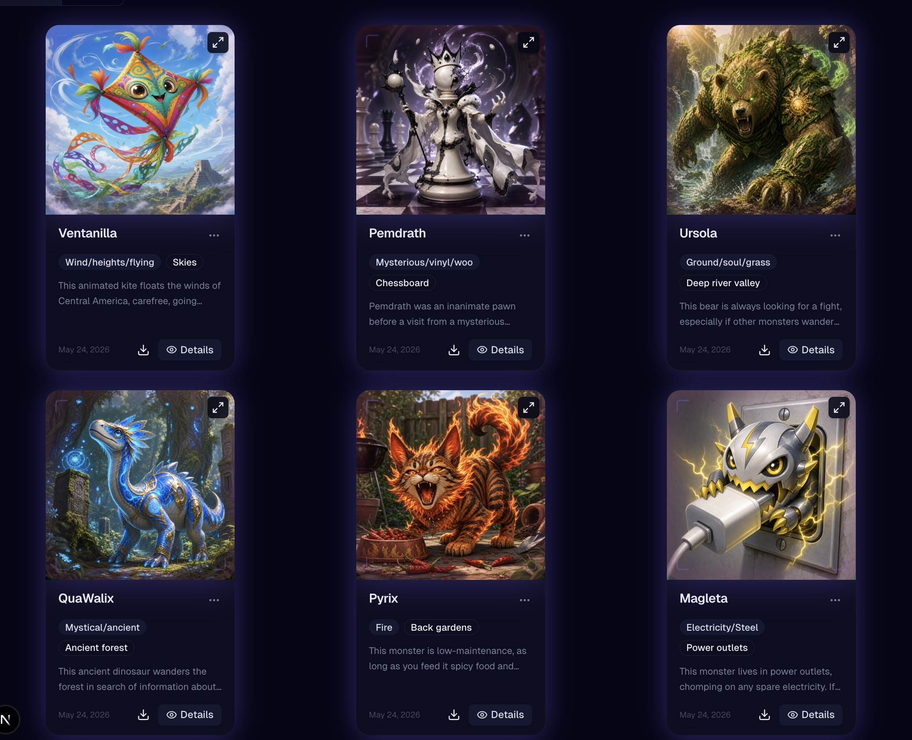
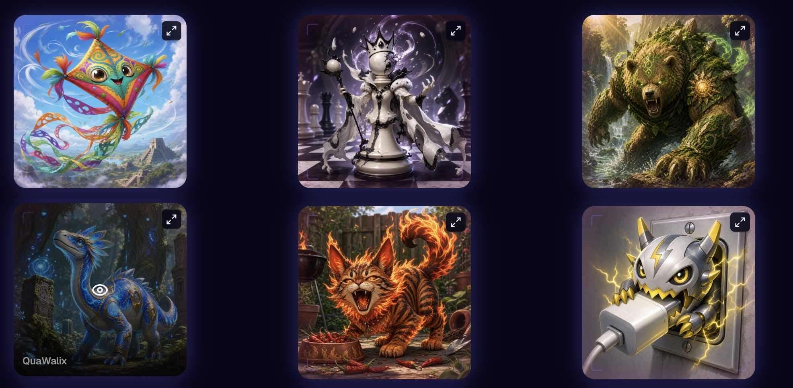

# Monster Masher

> Your next profile picture should have fangs.

**[Live app → monster-masher.vercel.app](https://monster-masher.vercel.app/)** · Free to use, no credit card required.

> **This is the general project overview README.** For deeper technical detail — API endpoints, auth internals, code conventions — see [backend/README.md](backend/README.md) and [frontend/README.md](frontend/README.md).

---

## Table of Contents

1. [What is Monster Masher?](#what-is-monster-masher)
2. [Screenshots](#screenshots)
3. [Features](#features)
4. [Tech Stack](#tech-stack)
5. [Project Structure](#project-structure)
6. [Getting Started](#getting-started)
   - [Prerequisites](#prerequisites)
   - [1. Backend setup](#1-backend-setup)
   - [2. Frontend setup](#2-frontend-setup)
   - [Running both together](#running-both-together)
7. [Environment Variables](#environment-variables)
   - [Backend](#backend)
   - [Frontend](#frontend)
8. [Development Workflow](#development-workflow)
9. [Running Tests](#running-tests)
10. [Deployment](#deployment)
11. [Further Reading](#further-reading)

---

## What is Monster Masher?

Monster Masher is a free web app for creating monster characters and generating AI-powered portrait images from them. Describe your monster — give it a name, traits, and flavour text — and the app generates a unique AI image you can use as a profile picture or keep in your collection.

**100% free.** No paywalls, no subscriptions, no credit card required.

---

## Screenshots






---

## Features

- **Monster catalog** — create monsters with names, traits, and flavour text; browse your collection in a gallery view
- **AI image generation** — one-click generation backed by a moderation → generate → store pipeline
- **Magic-link auth** — sign in with your email, no password required
- **Email notifications** — opt in to receive an email when your image is ready
- **Rate limiting** — up to 6 image generations per user per 24 hours
- **Fully free** — no paid tiers, no usage limits beyond the daily generation cap

---

## Tech Stack

| Layer            | Technology                                                      |
| ---------------- | --------------------------------------------------------------- |
| Frontend         | Next.js 16, React 19, TypeScript, Tailwind CSS 4, Redux Toolkit |
| Backend          | Django 6, Django REST Framework, Gunicorn                       |
| Database         | Supabase (PostgreSQL)                                           |
| Auth             | Supabase Auth (magic links)                                     |
| Image generation | Vercel AI Gateway + OpenAI                                      |
| Image storage    | Supabase Storage                                                |
| Email            | Resend                                                          |
| Error monitoring | Sentry (frontend + backend)                                     |
| Frontend hosting | Vercel                                                          |
| Backend hosting  | Render                                                          |

---

## Project Structure

```
monster-masher/
├── frontend/   # Next.js app (see frontend/README.md)
├── backend/    # Django REST API (see backend/README.md)
├── docs/       # Additional documentation
└── README.md   # You are here
```

---

## Getting Started

### Prerequisites

You will need accounts with the following external services. All have free tiers that are sufficient for local development and small-scale production use:

| Service                               | Purpose                                                           | Free tier                   |
| ------------------------------------- | ----------------------------------------------------------------- | --------------------------- |
| [Supabase](https://supabase.com)      | Database, auth, and image storage                                 | ✓                           |
| [Resend](https://resend.com)          | Transactional email — magic links and generation notifications    | ✓                           |
| [Sentry](https://sentry.io)           | Error monitoring (optional for local dev)                         | ✓                           |
| [OpenAI](https://platform.openai.com) | AI image generation (only needed if `IMAGE_GENERATION_MODE=real`) | ✓ (free credits on sign-up) |
| [Vercel](https://vercel.com)          | Frontend hosting (production only)                                | ✓                           |
| [Render](https://render.com)          | Backend hosting (production only)                                 | ✓                           |

You will also need:

- **Python 3.12+**
- **Node.js 18+** and npm

---

### 1. Backend setup

```bash
cd backend
python -m venv .venv
source .venv/bin/activate        # Windows: .venv\Scripts\activate
pip install -r requirements.txt
# Create backend/.env — use the Backend section of .env.example (repo root) as a guide
python manage.py migrate
python manage.py check           # verify configuration before starting
python manage.py runserver
```

Backend runs at **http://127.0.0.1:8000**. Swagger UI is available at **http://127.0.0.1:8000/api/docs/**.

---

### 2. Frontend setup

```bash
cd frontend
npm install
# Create frontend/.env.local — use the Frontend section of .env.example (repo root) as a guide
npm run dev
```

Frontend runs at **http://localhost:3000**.

---

### Running both together

Open two terminal tabs — one running `python manage.py runserver` in `backend/`, one running `npm run dev` in `frontend/`. The frontend proxies API requests to `http://localhost:8000`, so both must be running for the full app to work.

---

## Environment Variables

All env vars are documented in [`.env.example`](.env.example) at the repo root, split into **Frontend** and **Backend** sections. There is no single `.env` file — each app has its own (`frontend/.env.local` and `backend/.env`). The highlights:

### Backend (`backend/.env`)

| Variable                  | Description                                                                                                                   | Required |
| ------------------------- | ----------------------------------------------------------------------------------------------------------------------------- | -------- |
| `DJANGO_SECRET_KEY`       | Long random string for Django crypto operations                                                                               | ✓        |
| `DATABASE_URL`            | Supabase PostgreSQL connection string. Use direct connection or session pooler — **never** the transaction pooler (port 6543) | ✓        |
| `SUPABASE_URL`            | Your Supabase project URL (used for JWT verification)                                                                         | ✓        |
| `SUPABASE_JWT_ALGORITHM`  | `ES256` for new projects, `RS256` for older ones — check Supabase Dashboard → Authentication → JWT Signing Keys               | ✓        |
| `CORS_ALLOWED_ORIGINS`    | `http://localhost:3000` for local dev                                                                                         | ✓        |
| `NEXT_SERVER_SECRET`      | Shared secret for internal frontend→backend job-transition calls — must match the frontend value                              | ✓        |
| `SENTRY_DSN`              | Sentry project DSN (can be left blank for local dev)                                                                          | Optional |
| `MAX_GENERATIONS_PER_DAY` | Max image generations per user per 24 h — must match the frontend value (default: 6)                                          | Optional |

### Frontend (`frontend/.env.local`)

| Variable                               | Description                                                                                     | Required                      |
| -------------------------------------- | ----------------------------------------------------------------------------------------------- | ----------------------------- |
| `NEXT_PUBLIC_DJANGO_API_BASE_URL`      | Backend URL — `http://localhost:8000` for local dev                                             | ✓                             |
| `NEXT_PUBLIC_SUPABASE_URL`             | Your Supabase project URL                                                                       | ✓                             |
| `NEXT_PUBLIC_SUPABASE_PUBLISHABLE_KEY` | Supabase publishable (anon) key                                                                 | ✓                             |
| `NEXT_PUBLIC_APP_URL`                  | App's own base URL — `http://localhost:3000` for local dev                                      | ✓                             |
| `SUPABASE_SECRET_KEY`                  | Supabase secret (service role) key — server-side only, never exposed to the browser             | ✓                             |
| `SUPABASE_STORAGE_BUCKET`              | Name of the Supabase Storage bucket for images (e.g. `monster-images`)                          | ✓                             |
| `RESEND_API_KEY`                       | Resend API key for transactional email delivery                                                 | ✓                             |
| `NEXT_SERVER_SECRET`                   | Shared secret for internal frontend→backend job-transition calls — must match the backend value | ✓                             |
| `IMAGE_GENERATION_MODE`                | `fake` skips real API calls; `real` calls OpenAI via Vercel AI Gateway                          | Optional (defaults to `fake`) |
| `AI_GATEWAY_API_KEY`                   | Vercel AI Gateway API key (required when `IMAGE_GENERATION_MODE=real`)                          | Required when mode is `real`  |
| `AI_IMAGE_MODEL`                       | Image model to use (e.g. `openai/gpt-image-2`)                                                  | Required when mode is `real`  |
| `OPENAI_API_KEY`                       | OpenAI key used for prompt moderation (required when `IMAGE_GENERATION_MODE=real`)              | Required when mode is `real`  |
| `SENTRY_AUTH_TOKEN`                    | Only needed for production builds that upload source maps                                       | Optional                      |
| `MAX_GENERATIONS_PER_DAY`              | Max image generations per user per 24 h — must match the backend value (default: 6)             | Optional                      |

---

## Development Workflow

Run these steps before committing any change that touches the API:

1. **Regenerate the OpenAPI schema** (after any backend model or endpoint change):

   ```bash
   # From backend/ with the virtualenv active:
   python manage.py spectacular --file openapi.yaml
   ```

2. **Regenerate frontend API types** (after any OpenAPI change):

   ```bash
   # From frontend/:
   npm run generate:api
   ```

3. **Check for type drift** — if Zod schemas have drifted from the OpenAPI contract, this fails with a descriptive error:

   ```bash
   # From frontend/:
   npx tsc
   ```

4. **Lint:**

   ```bash
   # From frontend/:
   npm run lint
   ```

5. **Run both test suites:**

   ```bash
   # From frontend/:
   npm run test

   # From backend/ with virtualenv active:
   python manage.py test
   ```

6. **Verify Django configuration** (catches misconfiguration early):

   ```bash
   # From backend/ with virtualenv active:
   python manage.py check
   ```

7. **Run migrations** if you have added or changed models:

   ```bash
   # From backend/ with virtualenv active:
   python manage.py makemigrations
   python manage.py migrate
   ```

---

## Running Tests

**Frontend:**

```bash
cd frontend && npm run test
```

**Backend:**

```bash
cd backend && python manage.py test
```

See [backend/README.md](backend/README.md#running-tests) for details on what backend tests cover and how they are organised.

---

## Deployment

The app is deployed across several services:

| Service      | Role                                                                  |
| ------------ | --------------------------------------------------------------------- |
| **Vercel**   | Hosts the Next.js frontend                                            |
| **Render**   | Hosts the Django API                                                  |
| **Supabase** | PostgreSQL database, Auth, and image Storage                          |
| **Resend**   | Transactional email delivery (magic links + generation notifications) |
| **Sentry**   | Error monitoring for both frontend and backend                        |

For Render-specific configuration (build commands, required env vars, Root Directory setting) see [backend/README.md](backend/README.md#render-service-setup-prod).

---

## Further Reading

| Document                                 | Contents                                                                                     |
| ---------------------------------------- | -------------------------------------------------------------------------------------------- |
| [backend/README.md](backend/README.md)   | Django setup, all API endpoints, database configuration, code conventions, Render deployment |
| [frontend/README.md](frontend/README.md) | Next.js setup, auth flow, route handlers, Redux state shape, API contract conventions        |
